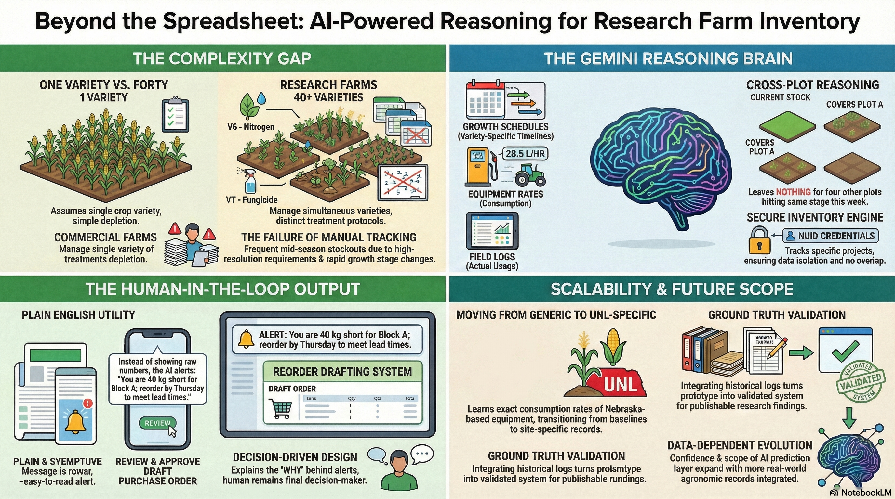
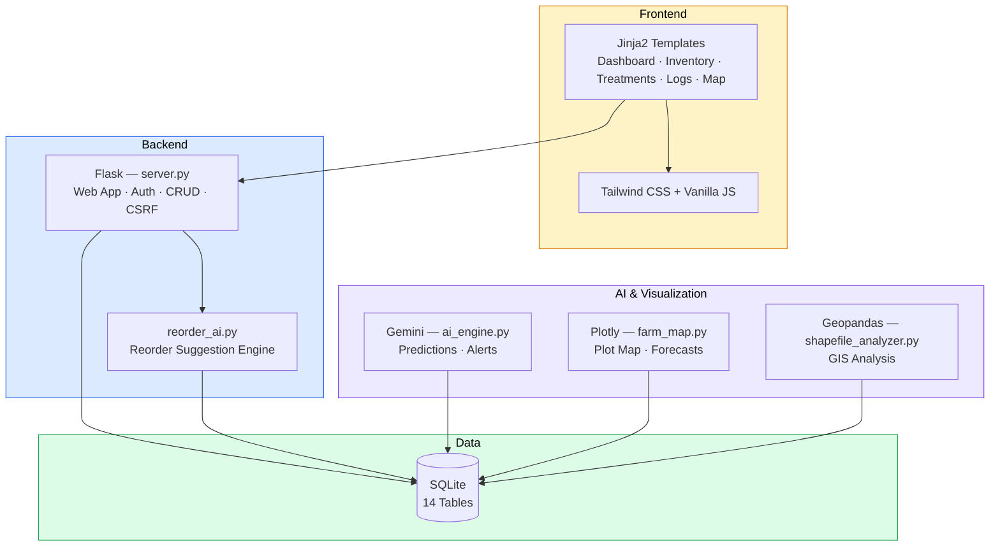

<div align="center">


# FieldMind

### AI-Powered Research Farm Manager

[](https://python.org)
[](https://flask.palletsprojects.com)
[](https://streamlit.io)
[](https://ai.google.dev)
[](https://sqlite.org)
[](https://engineering.unl.edu/bse/)

---

*Track inventory, plan treatments, log usage, and predict stockouts across research farm plots — powered by AI.*

Built for the **University of Nebraska–Lincoln** Department of Biological Systems Engineering.

**AGST 492 — Agentic AI for Workflow Automation · Spring 2026**

</div>

---

## Beyond the Spreadsheet — System Overview



<div align="center">

<a href="docs/FieldMind_Report.pdf">
  
</a>
&nbsp;&nbsp;
<a href="docs/FieldMind_Presentation.pptx">
  
</a>

</div>

---

## :sparkles: Features

<table>
<tr>
<td width="50%">

### :package: Inventory Management
Track fertilizers, herbicides, fungicides, fuel, and seed with reorder thresholds, supplier info, unit costs, and 7-day sparkline consumption trends.

### :calendar: Treatment Planning
Schedule plot-level treatments tied to crop growth stages. Overdue and upcoming treatments surface automatically on the dashboard.

### :memo: Usage Logging
Guided flow: select item → pick plot → choose equipment → confirm. Logs auto-deplete inventory on submission.

### :bar_chart: History & Export
Filterable usage history with pagination and CSV export. Filter by item, time period, and source (manual vs. AI-estimated).

</td>
<td width="50%">

### :brain: AI Reorder Suggestions
Gemini-backed reorder engine forecasts stockout dates, generates plain-English alerts, and surfaces suggestions when items hit threshold.

### :world_map: Interactive Farm Map
Plotly-powered plot visualization — click any plot for variety details, treatment history, and growth stage info. Includes inventory depletion forecast curves.

### :globe_with_meridians: Shapefile Analyzer
Upload farm shapefiles to visualize field boundaries, color polygons by any attribute, view the full attribute table, and match to database records.

### :lock: Role-Based Auth
UNL email authentication with admin / manager / viewer roles, session management, CSRF protection, and per-request authorization.

</td>
</tr>
</table>

---

## :building_construction: Architecture


```mermaid
graph TB
    subgraph Frontend
        B[Jinja2 Templates<br/>Dashboard · Inventory · Treatments · Logs · Map]
        B --> C[Tailwind CSS + Vanilla JS]
    end

    subgraph Backend
        D[Flask — server.py<br/>Web App · Auth · CRUD · CSRF]
        R[reorder_ai.py<br/>Reorder Suggestion Engine]
    end

    subgraph AIViz["AI & Visualization"]
        F[Gemini — ai_engine.py<br/>Predictions · Alerts]
        G[Plotly — farm_map.py<br/>Plot Map · Forecasts]
        H[Geopandas — shapefile_analyzer.py<br/>GIS Analysis]
    end

    subgraph Data
        I[(SQLite<br/>14 Tables)]
    end

    B --> D
    D --> R
    D --> I
    R --> I
    F --> I
    G --> I
    H --> I

    style Frontend fill:#fef3c7,stroke:#d97706,color:#000
    style Backend fill:#dbeafe,stroke:#2563eb,color:#000
    style AIViz fill:#ede9fe,stroke:#7c3aed,color:#000
    style Data fill:#dcfce7,stroke:#16a34a,color:#000
```

---

## :toolbox: Tech Stack

<table>
<tr>
<th align="left">Layer</th>
<th align="left">Technology</th>
</tr>
<tr><td><b>Web Server</b></td><td>Flask + Jinja2 + Flask-WTF (CSRF)</td></tr>
<tr><td><b>AI</b></td><td>Google Gemini <code>google-genai</code></td></tr>
<tr><td><b>ORM</b></td><td>SQLAlchemy 2.x</td></tr>
<tr><td><b>Database</b></td><td>SQLite</td></tr>
<tr><td><b>Frontend</b></td><td>Tailwind CSS, vanilla JS, Jinja2</td></tr>
<tr><td><b>Visualization</b></td><td>Streamlit, Plotly, Folium</td></tr>
<tr><td><b>GIS</b></td><td>Geopandas, Shapely, pyogrio</td></tr>
</table>

---

## :rocket: Getting Started

### Prerequisites

- Python 3.10+

### Installation

```bash
# Clone the repo
git clone https://github.com/Ishrat2110/fieldmind.git
cd fieldmind

# (Recommended) create a virtual env
python -m venv venv && source venv/bin/activate

# Install dependencies
pip install -r requirements.txt

# Set up environment variables
cp .env.example .env
# Then edit .env with your API keys
```

### Environment Variables

| Variable | Required | Description |
|----------|----------|------------|
| `DATABASE_URL` | yes | SQLAlchemy URL — defaults to `sqlite:///farm_manager.db` (relative). For an absolute path use four slashes: `sqlite:////abs/path/farm_manager.db` |
| `SECRET_KEY` | yes | Flask session-cookie signing key. **Generate your own** — see below. |
| `GEMINI_API_KEY` | optional | Google Gemini API key. If unset, reorder suggestions fall back to rule-based logic. |

> **Generating `SECRET_KEY`:** it's not a key you fetch from anywhere — you create it yourself. Any random string works; the easiest way is:
> ```bash
> python -c "import secrets; print(secrets.token_hex(32))"
> ```
> Copy the output into `.env` as `SECRET_KEY=<value>`.

### Initialize Database

```bash
python database.py
```

> Seeds a realistic UNL research farm: 10 users, 2 fields, 16 plots, 8 crop varieties, 7 inventory items, 40 treatment plans, and 14 days of usage history.

### Run

| Service | Command | URL |
|---------|---------|-----|
| :globe_with_meridians: **Web App** | `python server.py` | `http://localhost:5001` |
| :brain: **AI Engine** | `streamlit run ai_engine.py` | `http://localhost:8501` |
| :world_map: **Farm Map** | `streamlit run farm_map.py` | `http://localhost:8502` |
| :satellite: **Shapefile Analyzer** | `streamlit run shapefile_analyzer.py` | `http://localhost:8503` |

### Default Credentials

| Role | NUID | Password |
|------|------|----------|
| :red_circle: Admin | `12345678` | `admin123` |
| :large_blue_circle: Manager | `87654321` | `manager123` |

---

## :card_file_box: Database Schema

14 tables organized into four domains:

```
Users & Access          Crops & Land             Inputs & Equipment       Tracking
─────────────          ──────────────           ──────────────────       ────────
users                  crop_species             inventory_items          usage_logs
farms                  crop_varieties           equipment                treatment_plans
farm_members           growth_stages                                     activity_logs
                       fields                                            notifications
                       plots
```

---

## :file_folder: Project Structure

```
fieldmind/
│
├── server.py                  # Flask web app (auth, CRUD, dashboard)
├── models.py                  # SQLAlchemy models (14 tables)
├── database.py                # DB init + seed script
├── reorder_ai.py              # Reorder suggestion engine
├── seed_usage.py              # Extra usage data seeding
│
├── ai_engine.py               # Gemini AI predictions (Streamlit)
├── farm_map.py                # Interactive plot map (Streamlit)
├── shapefile_analyzer.py      # GIS shapefile tool (Streamlit)
│
├── templates/
│   ├── base.html              # Sidebar layout
│   ├── dashboard.html         # Main dashboard + charts
│   ├── inventory.html         # Stock management
│   ├── treatments.html        # Treatment schedules
│   ├── log.html               # Usage logging form
│   ├── history.html           # Usage history + export
│   ├── login.html             # Authentication
│   ├── map.html               # Plot map view
│   ├── suggestions.html       # AI reorder suggestions
│   └── users.html             # User management
│
├── docs/
│   ├── infographic.png              # System overview infographic
│   ├── FieldMind_Report.pdf         # Project report (AGST 492)
│   └── FieldMind_Presentation.pptx  # Final presentation slides
│
├── tests/                     # pytest suite + smoke test
├── requirements.txt
├── Nebraska_N_RGB.png         # UNL brand mark
└── .gitignore
```

---

<div align="center">

### Built at the University of Nebraska–Lincoln

Department of Biological Systems Engineering · AGST 492 Spring 2026


</div>
